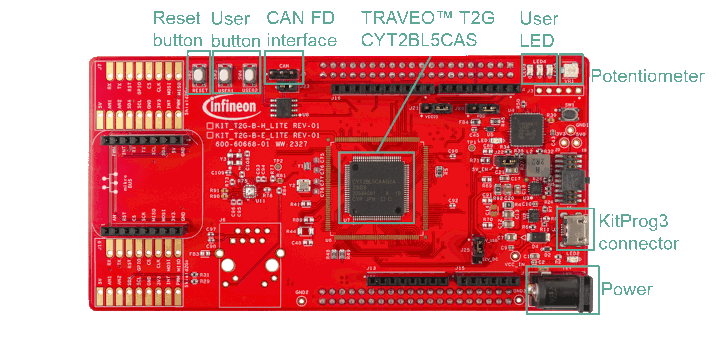

# Manchester Encoding and Decoding using Smart I/O

This code example demonstrates the encoding and decoding of Manchester protocol using Smart I/O and its verification.

## Requirements

- [ModusToolbox&trade;](https://www.infineon.com/modustoolbox) v3.2 or later (tested with v3.2)

## Supported toolchains (make variable 'TOOLCHAIN')

- GNU Arm&reg; Embedded Compiler v11.3.1 (`GCC_ARM`) – Default value of `TOOLCHAIN`

## Device

The device used in this code example (CE) is:
- [TRAVEO™ T2G CYT2BL Series](https://www.infineon.com/cms/en/product/microcontroller/32-bit-traveo-t2g-arm-cortex-microcontroller/32-bit-traveo-t2g-arm-cortex-for-body/traveo-t2g-cyt2bl-series/)

## Board

The board used for testing is:
- TRAVEO&trade; T2G Body Entry Lite evaluation kit ([KIT_T2G-B-E_LITE](https://www.infineon.com/evaluation-board/KIT-T2G-B-E-LITE))

## Scope of work

In this CE, the encoding and decoding of Manchester protocol is demonstrated. The data sent from Serial Peripheral Interface (SPI) master is encoded by a Smart I/O port.
This data is then sent to SPI slave where the data is decoded by another Smart I/O port. The decoded data is compared with the original data to verify if they are an exact match.
The encoding and decoding of the Manchester protocol is successful if they are an exact match.

## Introduction

**Serial Peripheral Interface (SPI)**

The SPI protocol is a synchronous serial interface protocol. Devices operate in either master or slave mode.
Only the master can initiate the data transfer. The Serial Communication Block (SCB) supports single-master-multiple-slaves topology for SPI. Multiple slaves - up to four - are supported with individual slave select lines.

A standard SPI interface consists of four signals as follows:
  - SCLK: Serial clock (clock output from the master, input to the slave).
  - MOSI: Master-out-slave-in (data output from the master, input to the slave).
  - MISO: Master-in-slave-out (data input to the master, output from the slave).
  - SELECT: Typically an active low signal (output from the master, input to the slave).

**Timer Counter Pulse Width Modulator (TCPWM)**

The TCPWM block in TRAVEO™ T2G has the following features:
  - 16- or 32-bit counters
  - Each counter can run in one of the seven function modes:
    - Timer-counter with compare
    - Timer-counter with capture
    - Quadrature decoding
    - Pulse width modulation/stepper motor control (SMC) for pointer instruments
    - PWM with dead time/three-phase motor control
    - Pseudo-random PWM
    - Shift register mode
  - Up, down, and up/down counting modes
  - Two output trigger signals for each counter to indicate underflow, overflow, and capture/compare events
  - Supports interrupt on terminal count, capture/compare
  - Synchronous operation of multiple counters

**Smart I/O**

The Smart I/O block adds programmable logic to an I/O port. This programmable logic integrates board-level Boolean
logic functionality such as AND, OR, and XOR into the port.

The Smart I/O in TRAVEO™ T2G has the following features:
  - Integrate board-level Boolean logic functionality into a port
  - Ability to pre-process HSIOM input signals from the GPIO port pins
  - Ability to post-process HSIOM output signals to the GPIO port pins
  - Support in all device power modes
  - Integrate closely to the I/O pads, providing shortest signal paths with programmability

For this CE, two Smart I/O ports are used for encoding and decoding.

More details of TRAVEO™ T2G CYT2BL Series can be found in Technical Reference Manual (TRM), Registers TRM and Data Sheet. (See the [here](https://www.infineon.com/products/microcontroller/32-bit-traveo-t2g-arm-cortex/for-body#documents) for Architecture TRM and Registers TRM, See the [here](https://www.infineon.com/products/microcontroller/32-bit-traveo-t2g-arm-cortex/for-body/t2g-cyt2bl#documents) for Datasheet)

**Manchester protocol**

Manchester encoding is a method of digital coding. Each bit is represented by a transition sequence from '0' to '1' or vice versa.
It is a self-clocking signal, that means that the clock is also transmitted with the encoded signal by applying XOR function between the data and clock signal.

In the IEEE 802.3 convention of Manchester encoding, the logical bits are defined as follows:
  - Logical 0 - bit sequence of 1 to 0
  - Logical 1 - bit sequence of 0 to 1

    *Figure 1. Manchester Protocol* 

**Manchester encoding**

In this CE, the Manchester signal is generated by using two SPI signals: SCLK and MOSI. The idle state is defined to be a high state.

In order to define the idle state, SPI SELECT line is used as well. Figure 2 shows the truth table for Manchester encoding. 
  *Figure 2. Manchester Encoding - Truth Table* 

However, SPI SELECT is not set to high immediately after the last SCLK clock cycle has completed, as shown in figure 3. 
  *Figure 3. Manchester Encoding Timing - Issue* 

This is because SELECT output signal has its hold time (between SPI clock edge to sample the last MOSI bit and SELECT deactivation) configured to 0.75 SPI clock cycles.
Hence, there is a delay of 0.25 times of the clock cycle, that results in an additional delay of 100ns (with a 2.5 MHz SPI clock) for the last bit.
This is a problem when the last bit is 0, as the time the bit stays in low state is 300ns instead of 200ns. To compensate this delay, gated input and gated output operations of LUT in Smart I/O is utilized.

  *Figure 4. Manchester Encoding - Concept* 

Figure 4 depicts the encoding using Smart I/O.

SCB2 is configured as master. The Smart I/O for encoding has a clock of 20 MHz that results in a clock period of 50 ns.
The operation of encoding in the Smart I/O is briefly mentioned below:
1. LUT1 performs the XOR operation of SPI data (MOSI) and SCLK. The XOR output signal is then delayed by 50ns. This is realized by a gated output LUT configuration.
2. LUT2 additionally delays the XOR signal by another 50ns using the gated input operation. Thus, the signal is delayed by a total of 100ns. LUT2 output is set to high when the SELECT is inactive (high), otherwise it outputs the XOR signal to the I/O port.
This compensates the timing delay issue caused by the SELECT line as seen in figure 5.

  *Figure 5. Manchester Encoding Timing after Resolution* 

**Manchester decoding**

There are a few observations to be noted for decoding:
- Whenever a bit is encoded, there is always a falling or rising edge in the encoded sequence. For instance, when '0' is encoded, there is a falling edge for the sequence '1'-'0'.
  Similarly, when '1' is encoded, there is a rising edge. These edges are referred to as *Mid-bit edges*.
- In the Manchester sequence (IEEE 802.3 convention), the second half of the encoded sequence represents the actual value of the data.
  Therefore, sampling point should be at a point after the mid-bit edge but before the next bit is encoded. 
  *Figure 6. Mid-bit Edge*  
- There is also an *end-bit edge* when identical bits are encoded consecutively. For instance, the below image shows two bits of '0' being encoded consecutively. 
  *Figure 7. End-bit Edge*  
- Here, a clock signal is created at the sample point, which is 100ns after mid-bit edge. This is used for SPI slave SCLK.
- Additionally, a SELECT signal also needs to be generated for the slave.  

  *Figure 8. Manchester Decoding - Concept* 

Figure 8 illustrates how decoding is done by the Smart I/O and the TCPWM blocks. The decoding is briefly explained below:
1. The Manchester_RX signal is first synchronised with the internal clock (80 MHz) of the Smart I/O and it is directly connected to the slave's MOSI.
2. LUT1 acts as a buffer that routes the signal.
3. LUT4 is configured to be a RS flipflop. The data stream in our example consists of preamble bits, where the first bit is always '1'. Since the idle level has been defined to be '1',
   there will always be a falling edge at the beginning of a transaction, which is not a mid-bit edge. 
   To filter out the first falling edge, the RS flipflop is set with the first falling edge. It is reset when there is no activity on the Manchester_RX line (signal in idle state).
4. To determine if there is an activity on the Manchester_RX line, TCPWM counter (group 0 counter 46) is used. This counter is configured in single-shot PWM mode. The timer is reloaded with the Manchester_RX signal (LUT6 acts as a buffer).
An edge is expected within every 400ns period. After the last bit of the Manchester data is received, a PWM one-shot signal is generated when there is no edge detected within 1µs. This output is fed into the 'reset' of the RS flipflop.
5. LUT3 already filters the first falling edge. The output will contain only mid-bit edges and end-bit edges. 
   *Figure 9. Decoding - Filtering First Edge*   
6. After filtering the first edge, the signal is passed through LUT5 that acts as an edge detector.
7. The data unit (DU) is configured to create a 300ns low pulse. Its function is to filter out the end-bit edge that arrives 200ns after the mid-bit edges. 
   *Figure 10. Decoding - Filtering End-bit Edge*   
8. Only mid-bit edges will now be passed to LUT7, which is the input to the reload of the TCPWM counter (group 0 counter 45). This PWM counter is also configured in one-shot mode.
Each of the mid-bit edges will trigger a PWM signal, resulting in a clock signal that is 100ns delayed after the mid-bit edge and the duty cycle is 50%.
9. This signal then is routed through LUT2 to the SPI clock input.
10. As the output of the RS flipflop in LUT4 is perfectly matching as a chip select signal, it is connected to the slave SELECT.
11. Due to the decoding logic, there is an additional clock pulse generated towards the end. As it arrives after the SELECT goes to its idle state, it will be ignored by SPI block. 
    *Figure 11. Decoding - SPI Clock Input*   

## Hardware setup

This CE has been developed for:
- TRAVEO™ T2G Body Entry Lite evaluation kit ([KIT_T2G-B-E_LITE](https://www.infineon.com/evaluation-board/KIT-T2G-B-E-LITE)) 
 
No changes are required from the board's default settings.

A jumper wire is connected between pin P14.2 (mikroBUS header J11.1 - Manchester_Tx) to pin P13.1 (mikroBUS header J11.6 - Manchester_Rx).

A UART serial connection should be made with the host via the serial port (KitProg3 connector). Use a terminal emulator to see the output on the screen. In the terminal emulator settings, select the KitProg3 COM port and set the baud rate to 115200.

## Implementation

**System setting**

In the Device Configurator, the following 'System' parameters are enabled/modified:
- External Crystal Oscillator (ECO)
- PATH_MUX1
- Phase-locked loops (PLL)
- High-frequency clock (CLK_HF0)

**Peripheral clock setting**

The following peripheral clocks are created under the 'Peripheral-Clocks' section of the device configurator:
- SPI master clock
- SPI slave clock
- Smart IO encoder clock
- Smart IO decoder clock
- TCPWM SPI clock
- TCPWM RS flipflop clock

**Pins setting**

In the 'Pins' section of the device configurator, the following ports should have their Smart I/O ports enabled.
- Port 14 for Manchester encoding
- Port 13 for Manchester decoding

The pins of port 14 and port 13 are also enabled/configured.

The following pins are configured for SPI master:
- MOSI - port 14, pin 1
- SCLK - port 14, pin 2
- SELECT - port 14, pin 3

The pins for SPI slave are:
- MOSI - port 13, pin 1
- SCLK - port 13, pin 2
- SELECT - port 13, pin 6

**Peripherals setting**

The device configurator's 'Peripherals' section is used to configure SPI and TCPWM counters:
- Serial communication block (SCB) 2 for SPI master
- SCB3 - SPI slave
- TCPWM group 0 counter 45 for SPI slave clock input
- TCPWM group 0 counter 46 for RS flipflop reset input

**Smart I/O setting**

Using the Smart I/O configurator, the encoder is configured as shown below:
- Smart I/O 14 routing 
  *Figure 12. Smart I/O Encoder Routing*   
- LUT configuration for Smart I/O 14 
  *Figure 13. Encoder LUT Configuration*   

The following configurations for the decoder are made as shown in the figures below:
- Smart I/O 13 routing 
  *Figure 14. Smart I/O Decoder Routing*   
- Data unit 
  *Figure 15. Smart I/O Decoder Data Unit*   
- LUT configuration for Smart I/O 13 
  *Figure 16. Decoder LUT Configuration*   

**STDOUT/STDIN setting**

Initialization of the GPIO for UART is done in the <a href="https://infineon.github.io/retarget-io/html/group__group__board__libs.html#gaddff65f18135a8491811ee3886e69707"><i>cy_retarget_io_init()</i></a> function.
- Initializes the pin specified by *CYBSP_DEBUG_UART_TX* as UART TX and the pin specified by *CYBSP_DEBUG_UART_RX* as UART RX (these pins are connected to KitProg3 COM port)
- The serial port parameters are 8N1 and 115200 baud

**Initialization of encoder**

*initSmartIOencoder()* handles the initialization of the encoder.
The function <a href="https://infineon.github.io/mtb-pdl-cat1/pdl_api_reference_manual/html/group__group__scb__spi__general__functions.html#gabe68169c810119b93e1164127663033c"><i>Cy_SCB_SPI_Init()</i></a> initializes SCB2 as SPI Master.
All the initializations in this CE use the generated structures from the device configurator.
After successful initialization, SPI master is enabled by <a href="https://infineon.github.io/mtb-pdl-cat1/pdl_api_reference_manual/html/group__group__scb__spi__general__functions.html#ga7e5d7cb17044cdd8ab1543e038bf89a8"><i>Cy_SCB_SPI_Enable()</i></a>

The Smart I/O for port 14 is initialized through <a href="https://infineon.github.io/mtb-pdl-cat1/pdl_api_reference_manual/html/group__group__smartio__functions__init.html#gac8cd44d9c01dad55dc324f410f0c267a"><i>Cy_SmartIO_Init()</i></a> and enabled via <a href="https://infineon.github.io/mtb-pdl-cat1/pdl_api_reference_manual/html/group__group__smartio__functions__init.html#gac25d71fa083b90fd27006daff3279eec"><i>Cy_SmartIO_Enable()</i></a>.

**Initialization of decoder**

*initSmartIOdecoder()* handles the initialization of the decoder.
<a href="https://infineon.github.io/mtb-pdl-cat1/pdl_api_reference_manual/html/group__group__scb__spi__general__functions.html#gabe68169c810119b93e1164127663033c"><i>Cy_SCB_SPI_Init()</i></a> initializes SCB3 as SPI slave.
The active slave SELECT is set to SELECT1 by <a href="https://infineon.github.io/mtb-pdl-cat1/pdl_api_reference_manual/html/group__group__scb__spi__general__functions.html#gaa94d2ec7eb38573274587eeff5635288"><i>Cy_SCB_SPI_SetActiveSlaveSelect()</i></a>.
<a href="https://infineon.github.io/mtb-pdl-cat1/pdl_api_reference_manual/html/group__group__scb__spi__general__functions.html#ga7e5d7cb17044cdd8ab1543e038bf89a8"><i>Cy_SCB_SPI_Enable()</i></a> enables SPI slave.

Then, the Smart I/O decoding block is initialized by <a href="https://infineon.github.io/mtb-pdl-cat1/pdl_api_reference_manual/html/group__group__smartio__functions__init.html#gac8cd44d9c01dad55dc324f410f0c267a"><i>Cy_SmartIO_Init()</i></a> and enabled via <a href="https://infineon.github.io/mtb-pdl-cat1/pdl_api_reference_manual/html/group__group__smartio__functions__init.html#gac25d71fa083b90fd27006daff3279eec"><i>Cy_SmartIO_Enable()</i></a>.

Finally, the TWCPWM counters for the RS flipflop reset input and SPI clock input are initialized using <a href="https://infineon.github.io/mtb-pdl-cat1/pdl_api_reference_manual/html/group__group__tcpwm__functions__pwm.html#ga6440d2a9dc8d85056abd62556bee7f82"><i>Cy_TCPWM_PWM_Init()</i></a> in PWM mode and they are enabled by <a href="https://infineon.github.io/mtb-pdl-cat1/pdl_api_reference_manual/html/group__group__tcpwm__functions__pwm.html#ga802ebf3a49b1056e4bc5b057deb26e49"><i>Cy_TCPWM_PWM_Enable()</i></a>.

A single shot PWM signal is triggered to reset the RS flipflop in the beginning by using the function <a href="https://infineon.github.io/mtb-pdl-cat1/pdl_api_reference_manual/html/group__group__tcpwm__functions__common.html#gaafe86ec440bec9a2c23392f289cc3a8b"><i>Cy_TCPWM_TriggerStart_Single()</i></a>.

**Code example main loop**

The endless loop of the code example in *main()* transmits the encoded Manchester data and decodes the received data.

First, the data (of size *MESSAGE_SIZE_BYTES*) is written into the SPI master's TX FIFO by <a href="https://infineon.github.io/mtb-pdl-cat1/pdl_api_reference_manual/html/group__group__scb__spi__low__level__functions.html#gad5415bd46d159b57f08fa0eb375a133e"><i>Cy_SCB_SPI_WriteArray()</i></a>.
Till *MESSAGE_SIZE_BYTES* are received by SPI slave, the program waits in a while loop. This is checked by the function <a href="https://infineon.github.io/mtb-pdl-cat1/pdl_api_reference_manual/html/group__group__scb__spi__low__level__functions.html#gaea6c37058e015b59c0e307d0d0e77ad0"><i>Cy_SCB_SPI_GetNumInRxFifo()</i></a>.
After the required bytes are received, the data is read from the RX FIFO using <a href="https://infineon.github.io/mtb-pdl-cat1/pdl_api_reference_manual/html/group__group__scb__spi__low__level__functions.html#gaecc7c7a8d0ba840fa5d65e5076cb9d84"><i>Cy_SCB_SPI_ReadArray()</i></a>.

The decoded data is compared with the original data. If they are a match, manchester encoding and decoding is successful.
For every successful comparison, the variable *successCount* is incremented else *failureCount* is incremented.

After every transmission, the value of the data, *messageData* is incremented and assigned to *sendBytes[1]*. *sendBytes[0]* is assigned with a constant value of *MESSAGE_PREAMBLE*

The verification status is displayed every *MESSAGES_PER_TEST* samples. This loop repeats every *DELAY_BETWEEN_TRANSFER_MS* ms.

## Run and Test

For this example, TeraTerm terminal is used for displaying outputs and to send data over UART. Install a terminal emulator if you do not have one. Instructions in this document use [Tera Term](https://teratermproject.github.io/index-en.html).

After code compilation, perform the following steps for flashing the device:
1. Connect the board to your PC using the provided USB cable through the KitProg3 USB connector.
2. Open a terminal program and select the KitProg3 COM port. Set the serial port parameters to 8N1 and 115200 baud.
3. Program the board using one of the following:
    - Select the code example project in the Project Explorer.
    - In the **Quick Panel**, scroll down, and click **[Project Name] Program (KitProg3_MiniProg4)**.
4. After programming, the code example starts automatically. Confirm that the initial messages are displayed on the UART terminal.
5. You can debug the example to step through the code. In the IDE, use the **[Project Name] Debug (KitProg3_MiniProg4)** configuration in the **Quick Panel**. For details, see the "Program and debug" section in the [Eclipse IDE for ModusToolbox™ software user guide](https://www.infineon.com/MTBEclipseIDEUserguide).

**Note :** **(Only while debugging)** On the CM4 CPU, some code in *main()* may execute before the debugger halts at the beginning of *main()*. This means that some code executes twice: once before the debugger stops execution, and again after the debugger resets the program counter to the beginning of *main()*. See [KBA231071](https://community.cypress.com/docs/DOC-21143) to learn about this and for the workaround.

**Expected behavior**

The terminal displays the number of successful and failed attempts of encoding and decoding Manchester data.
With the design implemented in this CE, there will always be successful verification status count. 
  *Figure 17. Terminal Display*   

## References

Relevant Application notes are:
- [AN235305](https://www.infineon.com/assets/row/public/documents/10/42/infineon-an235305-getting-started-with-traveo-t2g-family-mcus-in-modustoolbox-applicationnotes-en.pdf?fileId=8ac78c8c8b6555fe018c1fddd8a72801) - GETTING STARTED WITH TRAVEO™ T2G FAMILY MCUS IN MODUSTOOLBOX™
- [AN220224](https://www.infineon.com/row/public/documents/10/42/infineon-an220224---how-to-use-timer-counter-and-pwm-tcpwm-in-traveo-t2g-family-applicationnotes-en.pdf) - How to use Timer, Counter, and PWM (TCPWM) in TRAVEO™ T2G family
- [AN235303](https://www.infineon.com/gated/infineon-an235303---clock-configuration-setup-for-traveo-tm-t2g-family-mcus-in-modustoolbox-tm-applicationnotes-en_9c75aba2-fe5c-4225-920f-5be72d0fc8a1) - Clock configuration setup for TRAVEO™ T2G family MCUs in ModusToolbox™
- [AN225401](https://www.infineon.com/assets/row/public/documents/10/42/infineon-an225401---how-to-use-serial-communication-block-scb-in-traveo-t2g-family-applicationnotes-en.pdf?fileId=8ac78c8c7cdc391c017d0d3e657867d2) - How to use serial communications block (SCB) in TRAVEO™ T2G family
- [AN220203](https://www.infineon.com/gated/infineon-an220203---smart-i-o-usage-setup-in-traveo-t2g-family-applicationnotes-en_8af77a29-afb8-40fa-b2be-eda7f9dc0daf) - Smart I/O usage setup in TRAVEO™ T2G family

ModusToolbox™ is available online:
- <https://www.infineon.com/modustoolbox>

Associated TRAVEO™ T2G MCUs can be found on:
- <https://www.infineon.com/cms/en/product/microcontroller/32-bit-traveo-t2g-arm-cortex-microcontroller/>

More code examples can be found on the GIT repository:
- [TRAVEO™ T2G Code examples](https://github.com/orgs/Infineon/repositories?q=topic%3Akit-t2g-b-e-lite&type=all&language=&sort=) for [KIT_T2G-B-E_LITE](https://www.infineon.com/evaluation-board/KIT-T2G-B-E-LITE)

For additional training, visit our webpage:
- [TRAVEO™ T2G trainings](https://www.infineon.com/training/microcontroller-trainings)

For questions and support, use the TRAVEO™ T2G Forum:
- <https://community.infineon.com/t5/TRAVEO-T2G/bd-p/TraveoII>
